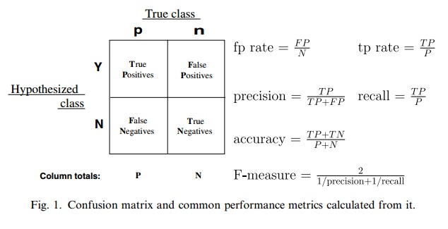



ROC（Receiver Operating Characteristic）曲线和AUC（Area Under Curve）常被用来评价一个二值分类器（binary classifier）的优劣。相比准确率、召回率、F-score这样的评价指标，ROC曲线有这样一个很好的特性：当测试集中正负样本的分布变化的时候，ROC曲线能够保持不变。在实际的数据集中经常会出现类不平衡（class imbalance）现象，即负样本比正样本多很多（或者相反），而且测试数据中的正负样本的分布也可能随着时间变化。

论文[3]是篇很不错的文章，介绍了ROC和AUC的特点，如何作出ROC曲线图和计算AUC，AUC的含义，以及对多类别分类问题如何计算AUC。后来有篇博文[4]翻译了这篇文章的核心部分，浅显易懂，适合不喜欢读英文的读者。

图1摘自论文[3]。ROC曲线，是以一系列的(fp rate, tp rate)或者写成(FPR, TPR)，为二维笛卡尔坐标系中的坐标点。应用到实际问题中，对一份训练集如何算出一系列的FPR和TPR，可以参考[3]或[4]。

AUC（确切的说，应该是AUROC）被定义为ROC曲线下的面积，显然这个面积的数值不会大于1。ROC曲线上的任意相邻两点与横轴都能形成梯形，把所有这样的梯形面积做加和即可得到AUC。一般而言，训练样本越多，在得到样本判别为正例的分数取值后不同分数也相对会越多，这样ROC曲线上的点也就越多，估算的AUC会更准些。这种思路很像微积分里常用的微分法。该方法正是在论文[3]中描述的方法，笔者在实际业务中实现了它，它并不难实现。

那么AUC值的含义是什么呢？在论文[3]，有这样一段话：”The AUC value is equivalent to the probability that a randomly chosen positive example is ranked higher than a randomly chosen negative example. This is equivalent to the Wilcoxon test of ranks (Hanley and McNeil, 1982). The AUC is also closely related to the Gini coefficient (Breiman et al., 1984), which is twice the area between the diagonal and the ROC curve. Hand and Till (2001) point out that Gini + 1 = 2 * AUC.”

简单翻译下：首先AUC值是一个概率值，当你随机挑选一个正样本以及一个负样本，当前的分类算法根据计算得到的Score值将这个正样本排在负样本前面的概率就是AUC值。AUC值越大，当前的分类算法越有可能将正样本排在负样本前面，即能够更好的分类。另外，AUC与Gini分数有联系，Gini + 1 = 2*AUC。

关于AUC表示的概率含义在ROC的维基百科词条[5]中也有说明。不过维基百科中还提到这样一个观点，机器学习领域中经常用ROC和AUC去做模型对比，最近学术界认为这种做法会引入一些错判，有些文章对此进行了讨论。笔者认为学术界值得认真讨论此问题，但在工业界，AUC指标一般与业务评价指标（比如点击率等）本身就不是一致的，所以在实际业务中，会综合考虑AUC指标以及其他指标来选择最终模型，这样做能降低选到不良模型的可能性。

既然了解了AUC表示的概率含义，那么就可以通过概率统计的方法来算AUC。做N次随机试验，每次实验中随机采样一个正样本和一个负样本，当模型预测正样本的分数大于模型预测负样本的分数，计数则加1。记计数最终为n（n肯定小于等于N），那么用n/N即得到AUC。stackexchange中的一篇帖子[6]在"A concordance measure"一节中也提到了这种算AUC的方法，并通过实验说明此方法计算出的AUC与画出ROC曲线然后算AUC面积是一致的。

### 参考文献

[1] Hanley, J.A., McNeil, B.J., The meaning and use of the area under a receiver operating characteristic (ROC) curve. Radiology 143, 29–36. 1982.

[2] Breiman, L., Friedman, J., Olshen, R., Stone, C., Classification and Regression Trees. Wadsworth International Group. 1984.

[3] Tom Fawcett, An introduction to ROC analysis. Pattern Recognition Letters. 2006.

[4] [introduction to auc and roc](http://alexkong.net/2013/06/introduction-to-auc-and-roc/)

[5] ROC(Receiver operating characteristic) ([From Wikipedia](https://en.wikipedia.org/wiki/Receiver_operating_characteristic))

[6] [how to calculate area under the curve auc or the c-statistic by hand](http://stats.stackexchange.com/questions/145566/how-to-calculate-area-under-the-curve-auc-or-the-c-statistic-by-hand)
